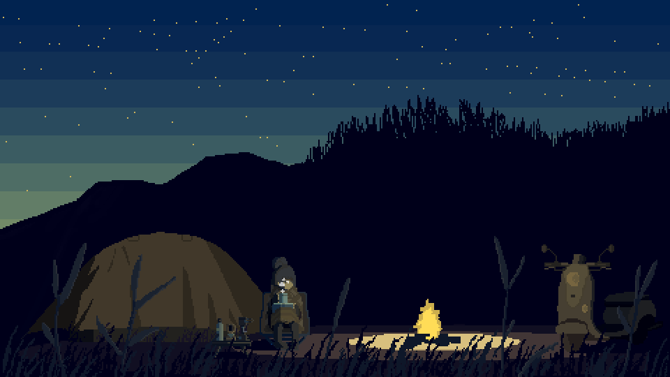
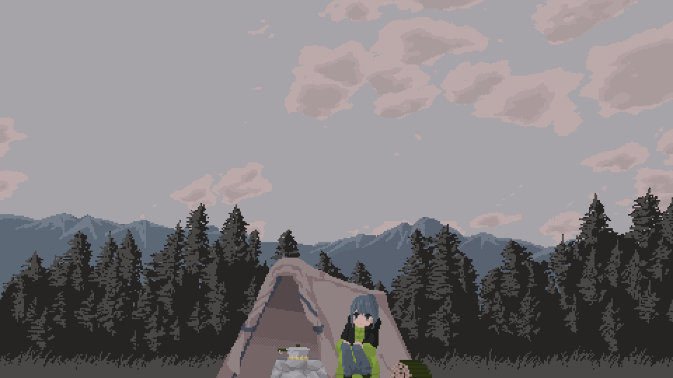

<h1>
    <span style="color: #fcee33;">Yahoo´-     I'm Aiko Ai :3</span>
</h1>

###### Building skills in C & systems programming | Exploring AI/ML | Code • Capture • Create

---

## About Me

```txt
 Name       : Annur Musthofa (Aiko Ai)
 Focus      : C & systems programming, backend basics  
 Exploring  : AI/ML and data  
 Currently  : Building projects step by step  
 Creative   : Photography • Guitar • Art
 Motto      : Try To Be Better ~
```
---

## Skills


---

## GitHub Stats

<p align="center">
  
  
</p>

---
<h2 align="center">ᯓ Now I'm Playing ᯓ </h2>

<p align="center">
  <a href="https://github.com/kittinan/spotify-github-profile">
    
  </a>
</p>

---

##  Social

<p align="center">
  <!-- Core -->
  <a href="https://github.com/AikoAii">
    
  </a>
  <!-- Professional -->
  <!-- <a href="https://linkedin.com/in/USERNAME">
    
  </a> -->

  <a href="mailto:yaikoaiii@gmail.com">
    
  </a>

  <!-- Community / Tech -->
  <!-- <a href="https://kaggle.com/USERNAME">
    
  </a> -->

  <a href="https://x.com/Pppfffttt512">
    
  </a>

  <a href="https://www.reddit.com/user/Same-Pack-2427/">
    
  </a>

  <!-- <a href="https://discord.com/users/aikoaii">
    
  </a> -->

  <!-- Content -->
  <a href="https://youtube.com/Aiko-Aii">
    
  </a>

  <!-- Personal -->
  <a href="https://instagram.com/itschikochi_">
    
  </a>

  <a href="https://facebook.com/AikooAii">
    
  </a>
</p>

---

## Support Me

<p align="left">
  <a href="https://trakteer.id/aikoaii" target="_blank">
    
  </a>
</p>

---



<!-- ⊹₊ **Thanks for stopping by!** ⊹₊

*“Stay curious, stay humble, keep building.”*--- -->

<h5 align="center">
<span style="color:#6CF">⊹₊ Thanks for stopping by ⊹₊.</span>
</h5>

<p align="center">
  <i>Stay curious • Stay humble • Keep building</i>
</p>

---
